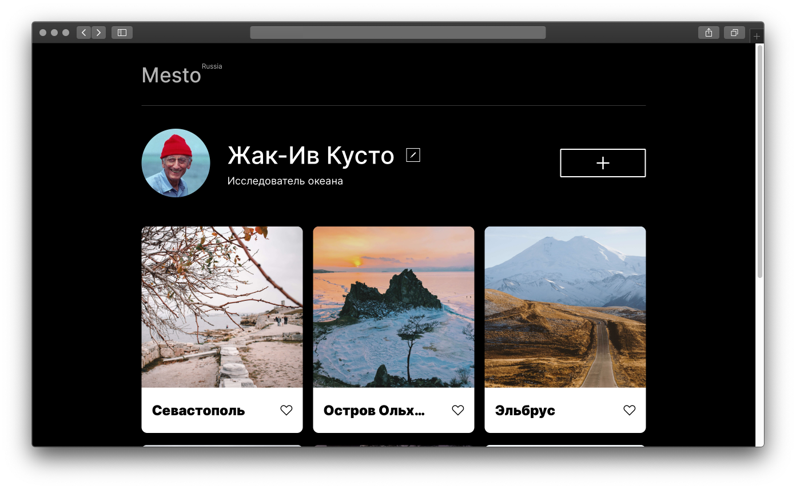

# Сервис Место

[Ссылка на GitHubPages](https://lenapronina.github.io/mesto/dist/index.html)

Mesto - первая проектная работа с использованием JavaScript. Сервис представляет собой страницу пользователя, содержащую список мест-путешествий. Можно добавить новую карточку, указав название места и прикрепив ссылку на картинку; ещё месту можно поставить лайк или вовсе удалить. 🤷‍♀️
Понравившееся фото можно посмотреть в более крупном формате - кликнув по нему.
А профиль пользователя – с именем и профессией - можно редактировать, заполнив поля формы.

Для полей ввода обеих форм - профиля пользователя и окошка добавления новой карточки - работает валидация: теперь уже нельзя вводить что попало: придётся для полей профиля разжиться двумя символами, а для карточки в названии можно и одним, но вот для картинки нужен будет URL!

Работа над этим проектом включает в себя освоение/использование таких практик как:
* Адаптивная вёрстка
* Вёрстка попапа
* Работа с формами
* Валидация форм
* Работа с массивами
* Работа с объектами
* Подключение JS скрипта
* Использование template-заготовки для отрисовки объектов из массива
* Понятие всплытия/погружения в методе addEventListener
* Использование функций, управление содержимым элементов
* ООП: использование классов, создание приватных и публичных методов
* ООП: связывание классов через функции-колбэки
* Сборка проекта через Webpack

**Используемые технологии**

HTML · CSS · Flexbox · Grid-layout · BEM · Nested BEM · Git · JS · GitHubPages · Webpack · npm
