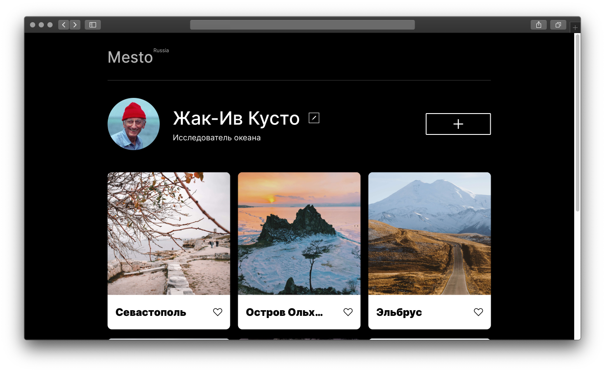

# Сервис Место

[Ссылка на GitHubPages](https://lenapronina.github.io/mesto/)


## О проекте
Mesto - проектная работа с использованием JavaScript. Сервис представляет собой страницу пользователя, содержащую список мест-путешествий.

### Функциональность
Можно создать новую карточку, указав название места и прикрепив ссылку на картинку; ещё месту можно поставить лайк (их теперь все могут оценить ♥️) или вовсе удалить (удалять можно только свою карточку, но только предварительно подтвердив, что действительно готовы с ней расстаться).
Понравившееся фото можно посмотреть в более крупном формате - кликнув по нему.
А профиль пользователя – с именем, профессией и аватаром - можно редактировать, заполнив поля формы. Для полей ввода всех форм работает валидация.
Приложение написано на JS с использованием классов.

### Работа над этим проектом включает в себя освоение/использование таких практик как:
* Адаптивная вёрстка
* Вёрстка попапа
* Работа с формами
* Валидация форм
* Работа с массивами
* Работа с объектами
* Подключение JS скрипта
* Использование template-заготовки для отрисовки объектов из массива
* Понятие всплытия/погружения в методе addEventListener
* Использование функций, управление содержимым элементов
* ООП: использование классов, создание приватных и публичных методов
* ООП: связывание классов через функции-колбэки
* Создание классa Api для передачи/получения информации с сервера
* Сборка проекта через Webpack


### Запуск проекта

Перед стартом убедитесь, что у вас установлен node.

1. Склонировать репозиторий
  ```
  git clone https://github.com/lenapronina/mesto.git
  ```
2. Перейти в директорию с проектом
  ```
  cd mesto
  ```
3. Установить зависимости
  ```
  npm install
  ```
4. Запустить приложение  
  ```
  npm run dev
  ```
5. Собрать оптимизированный build
  ```
  npm run build
  ```
6. Публикация на gh-pages с ссылкой на homepage
  ```
  npm run deploy
  ```

### Используемые технологии

HTML · CSS ·BEM · git · JS · GithubPages · webpack · npm
